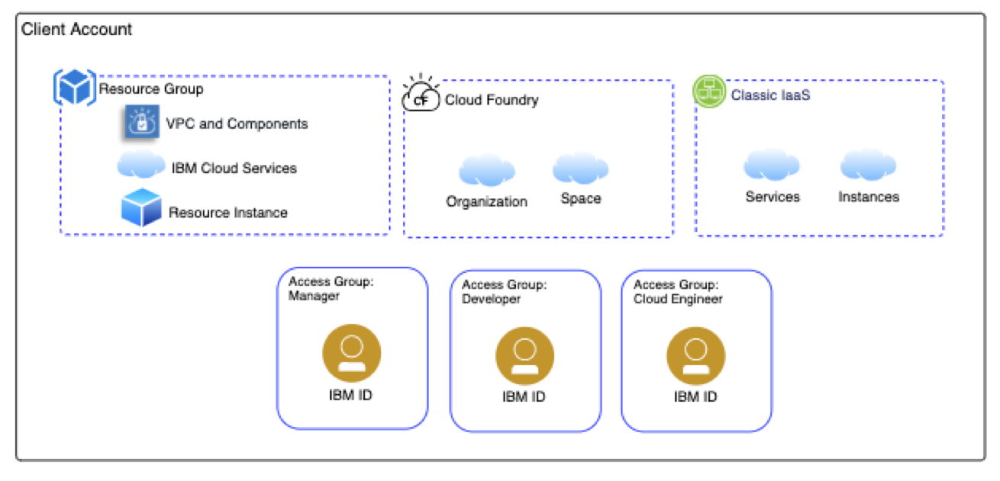

## Account, user and accesss control

IBM Cloud uses identify management services to control access to provision, configure and use cloud services. The management services cover [IAM](https://cloud.ibm.com/docs/iam?topic=iam-iamoverview), [Classic infrastructure](https://cloud.ibm.com/classic) and [Cloud Foundry](https://cloud.ibm.com/docs/cloud-foundry?topic=cloud-foundry-about) models. This solution uses the IAM and classic infrastructure identity services. Users are invited to the account and a variable is used to define the set of userid and access roles to individual services. You may [federate your enterprise ID system with IBM Cloud identity services](https://developer.ibm.com/dwblog/2018/identity-federation-ibm-cloud/) and change this solution to use the integration.  Access policies can be assigned to users an groups of users.  

---

### Access Control architecture diagram

---

### Components

- [Resource groups](https://cloud.ibm.com/docs/resources?topic=resources-rgs) This solution uses a single resource group representing a production like environment. The resource group is a feature used to organize account resources (virtual server instances, VPC, load balancers, etc) for access control and billing purposes.

- [Resources](https://cloud.ibm.com/docs/resources?topic=resources-resource) Resources are provisioned into the resource group. Access control can be applied to the services that are used to provision resources or to the the individual resources that are provisioned.

- [User and Service ID](https://cloud.ibm.com/docs/iam?topic=iam-iamconcepts) This solution anticipates the use of user/IBMid for people who are using cloud services and Service ID for applications/systems to interact with cloud services.

- [Access Group](https://cloud.ibm.com/docs/iam?topic=iam-groups) The access group is used to organize users and service IDs into a group and manage access by assigning policies to the group. This solution uses the access groups in the diagram above to manage access to a group of users based on the role and activities they need to perform with services in the resource group. 

- [Identify and access policies](https://cloud.ibm.com/docs/iam?topic=iam-userroles) This solution applies platform and service roles to access groups to enable deployment and use of the environment. The Service IDs are used for DevOps to provision resources, configure services and deploy applications and content.
 
