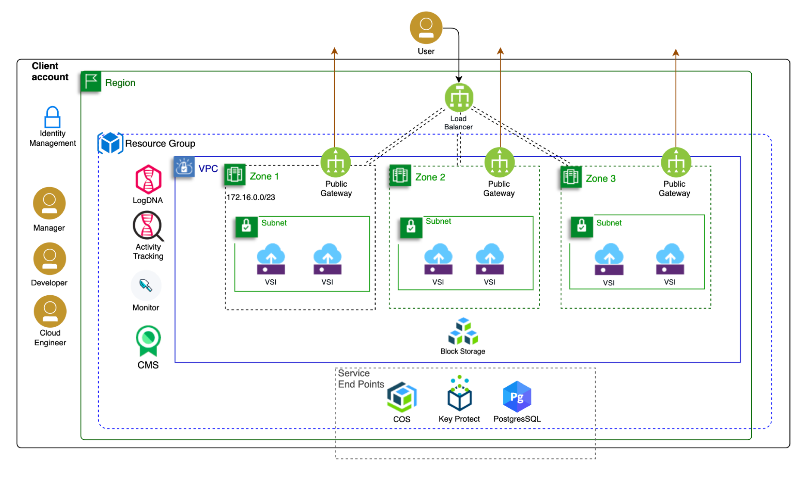

### Deploy Virtual Server workloads into a Virtual Private Cloud (VPC)

Enterprises moving or deploying to public cloud look for cloud native solutions that can be rapidly provisioned, changed and deprecated for their development teams. A cloud native environment includes networking services that should be rapidly deployed with infrastructure and platform services. IBM Cloud provides a fully virtualized networking capability through the use of a [Virtual Private Clouds (VPC)](https://www.ibm.com/cloud/vpc). The IBM Cloud VPC uses virtualized networking services such as subnets, load balancers, gateways and firewalls to deliver a cloud native capability.

The IBM Cloud VPC allows you to control a logically isolated portion of the IBM Cloud you use to deploy cloud resources. It gives you dynamic scalability for growth, [high availability](https://www.ibm.com/cloud/blog/improve-application-availability-scalability-and-security-with-ibm-vpc), and lower total cost of ownership so you can focus on delivering business innovation within IBM Cloud.

### Architecture views

To explain the capabilities of this solution we use architecture aspects that dive deeper into each view of the architecture (including networking, access control, security, compute) and align with the terraform contained in the repository.  When you are ready to deploy, check out the  [tutorial](https://www.ibm.com/cloud/architecture/architectures/public-cloud) for provisioning resources to IBM Cloud with terraform, review the infrastructure code and build your own environment.

### Fully automated cloud environments

Use the link [Get the code](../../infrastructure_code) below the diagram to access a repository with a detailed explanation of the architecture and the scripts to fully automate its provisioning into IBM Cloud. This reference solution describes the services and best practices to provision a highly available, secured virtual server instance-based workloads into IBM Cloud using a Virtual Private Cloud. This solution describes each of the essential aspects of the architecture including Security, Networking, Access, Data & Storage, Fabric/Compute and Operations. Within this repository the [infrastructure_code](../../infrastructure_code) folder contains the scripts your team can use to immediately provision and explore the solution to plan and design your IBM Cloud environments.

Use IBM Cloud Terraform provider images to immediately deploy and explore the architecture in IBM CLoud.

---

---
