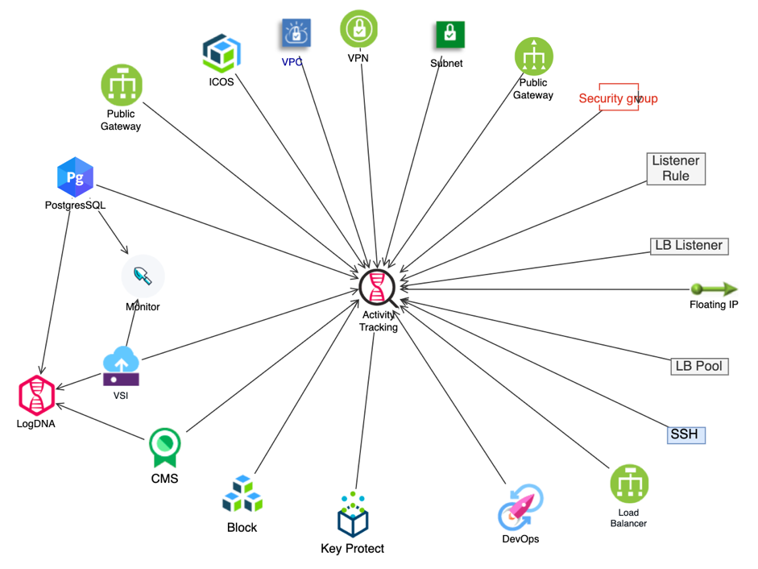

## DevOps and Operations

This page describes the capabilities of the services to perform DevOps including deploying applications and data to the resources and management of the architecture resources. The diagram describes which service components report data to the management services.

- Provisioning: To provision this infrastructure solution, use the IBM Cloud Terraform provider and the code contained in the [infrastructure_code](../../infrastructure_code) folder of this repository. Terraform is the primary technology to deploy this solution.

- Application & service configuration deployment: If you use the IBM Cloud DevOps toochain, refer to the [private worker](https://www.ibm.com/cloud/blog/continuously-deliver-with-private-pipeline-workers) guidance for accessing private end points. If you plan to use your own or another Devops provider to deploy applications and service configurations, then consider [using a bastion server](https://cloud.ibm.com/docs/vpc-on-classic?topic=solution-tutorials-vpc-secure-management-bastion-server) to access private end points in the VPC. Otherwise, you can temporarily attach a public floating IP to each VSI and enable the public service end point on your cloud services.

- Management: Several VPC services [report events](https://cloud.ibm.com/docs/vpc-on-classic?topic=vpc-on-classic-at-events) to the [Actvity Tracker](https://cloud.ibm.com/docs/services/Activity-Tracker-with-LogDNA?topic=logdnaat-getting-started#getting-started) service. In this solution, CMS, PostgeresSQL and the VSIs also report to the [LogDNA](https://www.ibm.com/cloud/log-analysis) and [monitoring](https://www.ibm.com/cloud/sysdig) services.
