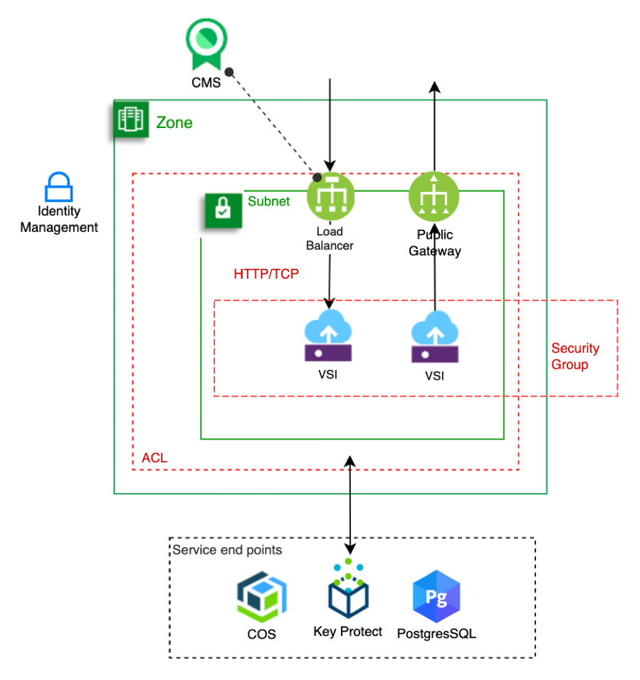

## Security 

The Security aspect describes the cloud services, integrations, configurations necessary to secure the environment, network and access controls for your a cloud environment.

---

### Architecture diagram

---

### Architecture components

- [Load Balancer](https://cloud.ibm.com/docs/vpc-on-classic-network?topic=vpc-on-classic-network---using-load-balancers-in-ibm-cloud-vpc&locale=en-us): This solution uses a load balancer for only incoming traffic. Layer 7 rules restrict incoming packages based on a ruleset.

- [Public gateway](https://cloud.ibm.com/docs/vpc-on-classic-network?topic=vpc-on-classic-network-about-networking-for-vpc&locale=en-us#use-a-public-gateway): The gateway limits communications to only outbound for VSIs which use a single IP end point for all VSIs on the subnet.

- **[Access Control Lists](https://cloud.ibm.com/docs/vpc-on-classic-network?topic=vpc-on-classic-network-setting-up-network-acls)**: The three subnets use a common Access Control List (ACL) as a virtual firewall. The ACL is configured to limit incoming traffic from the internet to and from each subnet. For this solution an ACL configuration includes limitations on the traffic from the public network.

- **[Security Groups](https://cloud.ibm.com/docs/vpc-on-classic-network?topic=vpc-on-classic-network-using-security-groups)**: A security group is used to define the rules for each VSI. For this solution a set of policies that limit communications to/from the VSIs will be applied to each VSI. Please see the [table comparing ACL and Security Groups](https://cloud.ibm.com/docs/vpc-on-classic-network?topic=vpc-on-classic-network-compare-security-groups-and-access-control-lists) in the IBM Cloud Documentation.

- **[SSH keys](https://cloud.ibm.com/docs/vpc-on-classic-vsi?topic=vpc-on-classic-vsi-ssh-keys)**: A single SSH key is used to provide access to the VSIs through public-key cryptography. After an instance is created, you can edit keys directly in the ~/.ssh/ directory of the instance.

- **[Certificate Manager - CMS](https://cloud.ibm.com/docs/services/certificate-manager?topic=certificate-manager-about-certificate-manager)**: Certificate manager is used to obtain, store, and manage TLS/SSL certificates for your IBM Cloud-based applications. The solution uses the [authorizations](https://cloud.ibm.com/docs/iam?topic=iam-serviceauth#create-auth) between the LBaaS and CMS to enable LBaaS to access the SSL/TLS certificate.

- **[Key protect](https://cloud.ibm.com/docs/services/key-protect?topic=key-protect-about)**: Key Protect is used to encrypt the object storage and data service data at rest. This solution uses a default configuration but you can evolve the solution to include bringing your own key (BYOK).  For this solution, the applications deployed into VSIs will use Key protect integrations with:

- [Cloud Object Storage](https://cloud.ibm.com/docs/services/key-protect?topic=key-protect-integrate-cos) secruity features used in this solution include:
  - access group and IAM policies to limit access
  - [server side encryption](https://cloud.ibm.com/docs/services/cloud-object-storage?topic=cloud-object-storage-encryption#encryption-kp) with key protect. [Authorization](https://cloud.ibm.com/docs/iam?topic=iam-serviceauth#create-auth) with Key protect to access Key Protect encryption keys.
  - [APIkey](https://cloud.ibm.com/docs/services/cloud-object-storage?topic=cloud-object-storage-service-credentials) to control connections

- [PostgresSQL database](https://cloud.ibm.com/docs/services/databases-for-postgresql?topic=cloud-databases-key-protect) security features used in this solution includes:
  - access group and IAM policies to limit access
  - an SSL connection using a self signed certifcate to secure data in transit
  - generated service credentials to control connections
  - [authorization](https://cloud.ibm.com/docs/iam?topic=iam-serviceauth#create-auth) with Key protect to access encryption keys.
  
